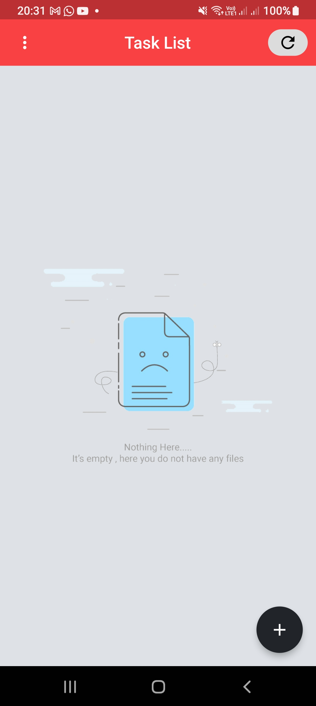
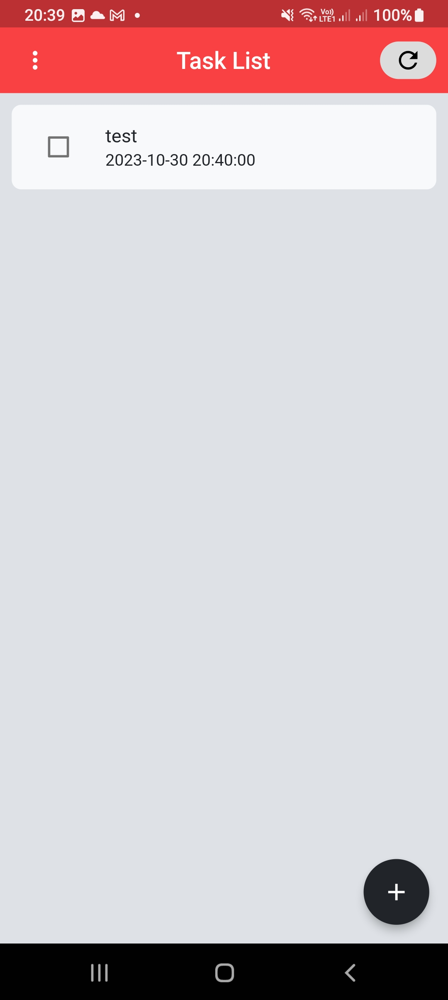
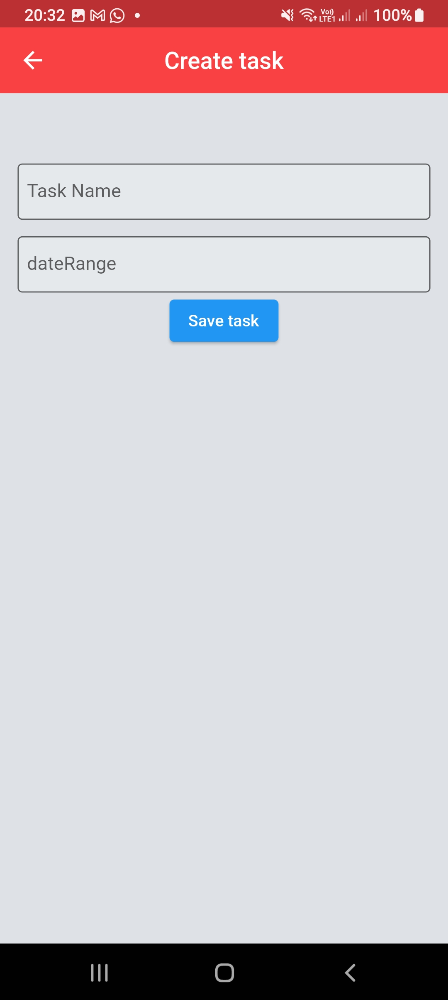
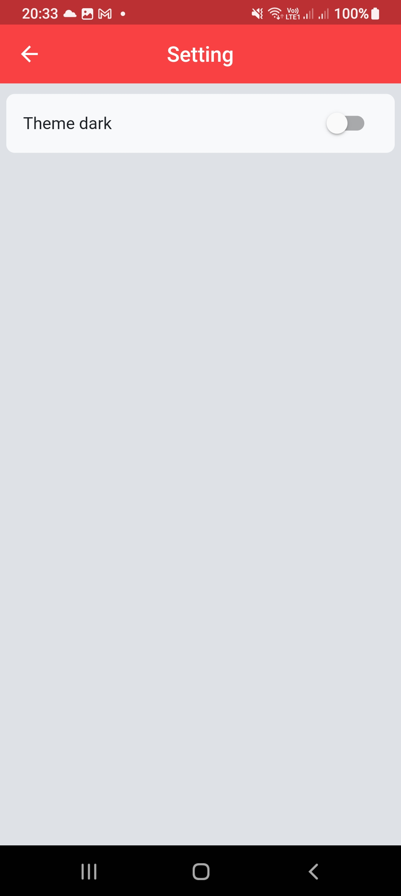

[](https://flutter.dev/)
[](https://dart.dev/)
[](https://www.jetbrains.com/idea/)

### Este é um aplicativo simples de lista de tarefas desenvolvido em Flutter, uma estrutura de UI open-source do Google para criar aplicativos nativos para dispositivos móveis, web e desktop a partir de uma única base de código.

## Baixe o app

[download](https://github.com/thebinario/flutter-todo/releases)


## Capturas de Tela






## Funcionalidades

- Adicionar novas tarefas à lista.
- Marcar tarefas como concluídas.
- Excluir tarefas da lista.
- Editar tarefas existentes.

## Requisitos de Instalação

- [Flutter SDK](https://flutter.dev/docs/get-started/install)
- [Dart SDK](https://dart.dev/get-dart)


1. Clone o repositório para o seu ambiente local:

   ```bash
   git clone https://github.com/seu-usuario/nome-do-repositorio.git
   ```
2. Navegue até o diretório do projeto:

    ```bash
    cd nome-do-repositorio
    ```

3. Instale as dependências do Flutter:

    ```bash
    flutter pub get
    ```

4. Execute o aplicativo no seu dispositivo ou emulador:

    ```bash
    flutter run
    ```

## Contribuindo
Sinta-se à vontade para contribuir para o desenvolvimento deste aplicativo. Se você encontrar bugs ou tiver sugestões para melhorias, por favor, crie uma issue ou envie um pull request.

## Agradecimentos

Esperamos que você aproveite usando este aplicativo de lista de tarefas em Flutter! Se tiver alguma dúvida ou problema, não hesite em entrar em contato. Obrigado por usar o nosso aplicativo!
